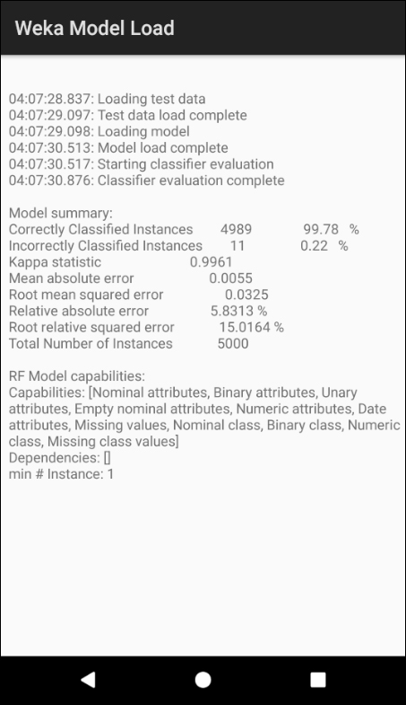

# Weka-Model-Load
This repository includes a the Weka model Load app for Android. It is an Android Studio project which load a pre-trained Weka model which can then be used for predictions.

This project is covered in detail in chapter 6 of the [book](https://www.apress.com/us/book/9781484239506):

# About the Project
This Android all Loads a pre-trained model, and perform a batch classification of 5,000 instances loaded from a file to test the classifier.

The app includes time stamps at each stage of the process so we can check the performance. 

Android has some sophisticated tools for performance benchmarking, but we will just use a simple time stamp. The goal is to determine if the library performance on Android is sufficient for typical use cases. 

In chapter 5, we created the following two models using the RF algorithm for subject101 of the large PAMAP2_Dataset:

* rf_i10_cross.model - The RF iteration parameter i=10 and the model size is approximately 5 Mb. Cross-fold validation was used to train the model.
* rf_i100.model - The RF iteration parameter i=100 and the model size is approximately 55 Mb. Split data (2/3 train and 1/3 test) was used to train the model.

# Project References

Project Name: **Weka Model Load**

Source: **WekaModelLoad.zip** or **github.com/wickapps/Weka-Model-Load**

Type: **Android Studio Project**

# File Description

| File                             | Description                                                  |
| -------------------------------- | ------------------------------------------------------------ |
| app->libs->Weka-Android-3-8-1.jar | The Weka jar file for Android generated from the Eclipse project. |
| app->src->main->assets->rf_i10_cross.model | RF pre-trained model |
| app->src->main->java->MainActivity.java | The app's main java file. The project has a single activity. |
| app->src->main->res->layout->activity_main.xml | The layout file for the single screen display output. |
| app->src->main->res->raw->rf_i10_cross.model | A second copy of the pre-trained RF model to demonstrate access from the raw directory. |
| app->src->main->res->raw->subject101_cleaned_5k.arff | ARFF file with 5,000 instances to test the classification model. |
| app->src->main->res->AndroidManifest.xml | Manifest file. |

# Application Screenshot
